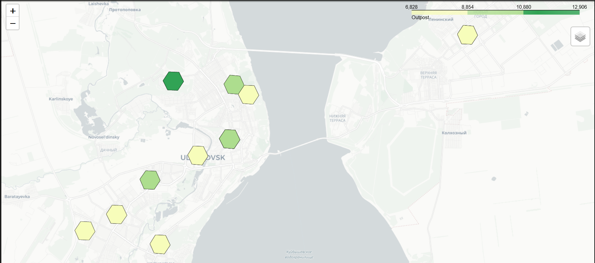
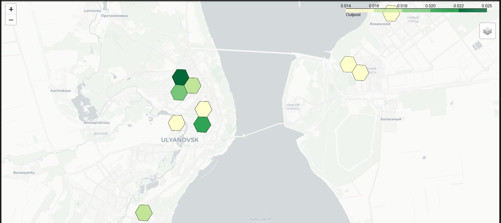
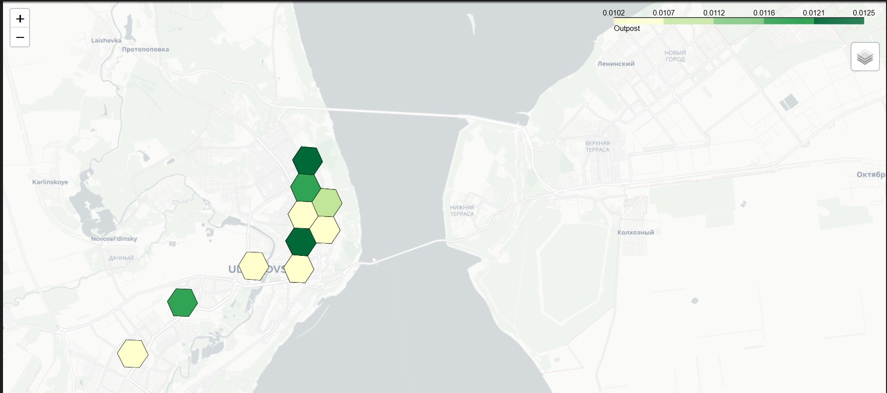

# machine-learning-technologies

ИТМО, Финансовые технологии больших данных 
Предмет: технологии машинного обучения

## Описание
Данная работа была сделана для предмета технологии машинного обучения на первом курсе магистратуры в ИТМО. Суть работы: поиск потенциальных мест для открытия ПВЗ (пункт выдачи заказов) в Ульяновске. Я использовал информацию из OSM (OpenStreetMap) для примерного расчета плотности людей в городе.

В ноутбуке edz.ipynb представлен код для формирования гексогональной сетки в городе, извлечения данных из OSM, расчета примерной плотности людей, отображения этой информации на интерактивной карте и поиска подходящих гексагонов.

## Результаты

Чем более насыщенный зеленый, тем предпочтительнее гексагон в результате работы алгоритма. 
Более подробно алгоритмы описаны в ноутбуке.

### Бейзлайн
Выбираю наилучший гексагон на основе эвристики.

### PageRank
PageRank позволяет учитывать связь между соседними гексагонами, чем важнее соседи гексагона, тем важнее он сам.

### Personalized PageRank
По сравнению с PageRank добавляется дополнительная величина - предпочтительность гексагонов, чем выше предпочтительность гексагона, тем выше шанс, что алгоритм пометит гексагон важным.

